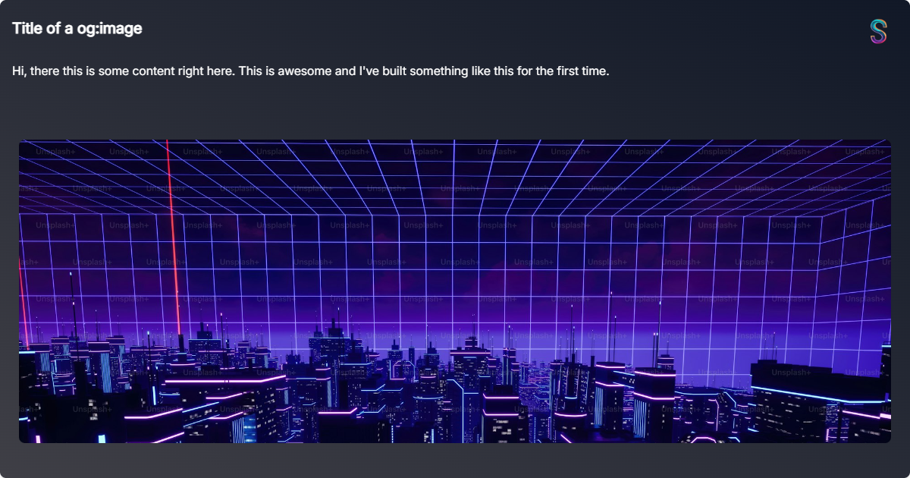

This is a [Next.js](https://nextjs.org/) project bootstrapped with [`create-next-app`](https://github.com/vercel/next.js/tree/canary/packages/create-next-app).

## Getting Started

Install the dependencies

```bash
npm install
# or
yarn install
# or
pnpm install
# or
bun install
```

Then, run the development server:

```bash
npm run dev
# or
yarn dev
# or
pnpm dev
# or
bun dev
```

Open [http://localhost:3000](http://localhost:3000) with your browser to see the result.

At the `/` page there's a form where you can fill in the title, content and image. The image is optional.

After which it directs you to a new page with the generated image.



The styling is done with the help of TailwindCSS and ShadCN, making it easier to build and maintain. I had the plans of having color options in the form itself but due to time constraints I couldn't do it. I'll work on it later. Making the images accesible via a link is a future goal via firebase or any other Backend.
